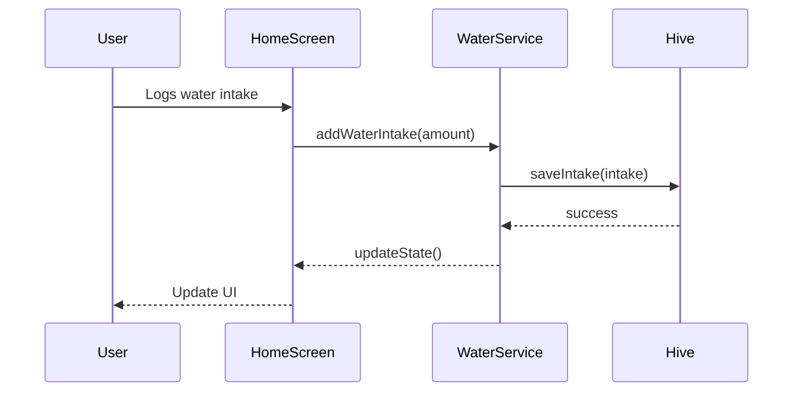

# DESIGN.md

## Overview

This document outlines the design for a Flutter-based water reminder application. The app's primary goal is to help users track their daily water intake, schedule reminders, and view their progress over time. The application will feature a modern, clean, and intuitive user interface.

## Detailed analysis of the goal or problem

Many people struggle to drink enough water throughout the day due to busy schedules or simply forgetting. This application aims to solve this problem by providing a simple and effective tool to:

-   **Set a daily water intake goal:** Users can manually set their own goal.
-   **Log water intake:** Users can log their water consumption using both predefined and custom amounts.
-   **Receive reminders:** The app will send simple notifications to remind users to drink water at scheduled intervals.
-   **Track progress:** A history view will allow users to see their intake over time, helping them to stay motivated.

The app will be designed with a focus on user experience, making it easy and enjoyable to use.

## Alternatives considered

### State Management

-   **Provider:** A popular choice for state management, but can lead to boilerplate code.
-   **BLoC/Cubit:** A powerful pattern, but can be overly complex for a simple application like this.
-   **Riverpod:** A more modern and flexible solution than Provider, but still might be more than what is needed.
-   **ChangeNotifier/ValueNotifier:** Built-in Flutter solutions that are simple and effective for managing local and shared state. Given the simplicity of this app, `ChangeNotifier` and `ValueNotifier` are the most appropriate choices.

### Data Persistence

-   **shared_preferences:** Ideal for storing simple key-value data like user settings (e.g., daily goal, notification preferences).
-   **sqflite:** A full-featured SQL database, which is too complex for the needs of this application.
-   **Hive:** A lightweight and fast NoSQL database written in pure Dart. It's a great choice for storing structured data like water intake history.

### Notifications

-   **awesome_notifications:** A powerful notification plugin with many features.
-   **flutter_local_notifications:** A well-maintained and widely used plugin for local notifications. It provides all the necessary features for this application and is the most straightforward to implement.

## A detailed design for the new package

### Architecture

The application will follow a feature-based architecture, with each feature having its own directory containing the necessary widgets, models, and services. The main layers will be:

-   **Presentation:** The UI layer, containing widgets and screens.
-   **Domain:** The business logic layer, containing models and services.
-   **Data:** The data layer, responsible for data persistence and retrieval.

### UI/UX

The UI will be clean, modern, and intuitive. The design will be inspired by the research conducted on Dribbble and Behance, incorporating the following elements:

-   **Visual Progress Indicators:** A circular progress bar on the home screen will provide a clear visual representation of the user's daily progress.
-   **Water-Themed Color Palette:** The color scheme will be based on shades of blue and green to create a calming and refreshing feel.
-   **Intuitive Logging:** Large, easy-to-tap buttons for predefined water amounts and a simple way to enter custom amounts.
-   **Statistics and History:** A dedicated screen will display the user's intake history with simple charts.
-   **Light and Dark Themes:** The app will support both light and dark modes.

### State Management

-   `ValueNotifier` will be used for managing simple, local state within individual widgets.
-   `ChangeNotifier` will be used for managing shared app state, such as the user's daily goal and water intake history.

### Data Persistence

-   `shared_preferences` will be used to store the user's daily goal and notification settings.
-   `hive` will be used to store the water intake history.

### Notifications

-   `flutter_local_notifications` will be used to schedule and display simple reminders.

## Diagrams

### App Architecture

```mermaid
graph TD
    A[Presentation (UI)] --> B[Domain (Business Logic)];
    B --> C[Data (Persistence)];

    subgraph Presentation (UI)
        D[Home Screen]
        E[History Screen]
        F[Settings Screen]
    end

    subgraph Domain (Business Logic)
        G[WaterService]
        H[NotificationService]
        I[SettingsService]
    end


    subgraph Data (Persistence)
        J[Hive (Water Intake History)]
        K[SharedPreferences (Settings)]
    end

    D --> G;
    E --> G;
    F --> I;
    G --> J;
    H --> K;
    I --> K;
```

### Data Flow



## A summary of the design

The water reminder app will be a simple yet effective tool for tracking water intake. It will be built with Flutter, using `ChangeNotifier` and `ValueNotifier` for state management, `hive` for data persistence, and `flutter_local_notifications` for reminders. The UI will be modern, clean, and intuitive, with a focus on user experience.

## References to research URLs used to arrive at the design

-   **Modern Flutter Architecture:** [https://www.google.com/search?q=modern+flutter+architecture+2024](https://www.google.com/search?q=modern+flutter+architecture+2024)
-   **Water Reminder App UI/UX Inspiration:** [https://www.google.com/search?q=water+reminder+app+UI/UX+dribbble+behance](https://www.google.com/search?q=water+reminder+app+UI/UX+dribbble+behance)
-   **flutter_local_notifications:** [https://pub.dev/packages/flutter_local_notifications](https://pub.dev/packages/flutter_local_notifications)
-   **hive:** [https://pub.dev/packages/hive](https://pub.dev/packages/hive)
